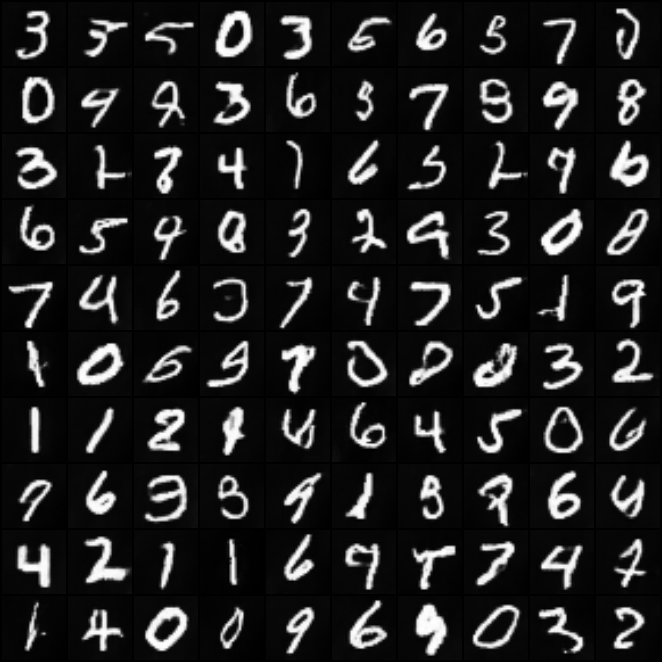
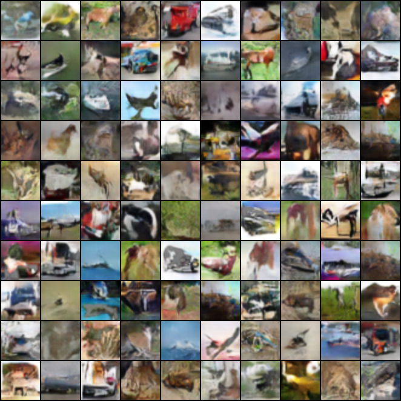

# DCGAN-PyTorch

## Overview
This repository contains an Pytorch implementation of Auxiliary Classifier GAN.
With full coments and my code style.

## About ACGAN
If you're new to ACGAN, here's an abstract straight from the paper[1]:

In this paper we introduce new methods for the improved training of generative adversarial net- works (GANs) for image synthesis. We con- struct a variant of GANs employing label condi- tioning that results in 128 × 128 resolution im- age samples exhibiting global coherence. We expand on previous work for image quality as- sessment to provide two new analyses for assess- ing the discriminability and diversity of samples from class-conditional image synthesis models. These analyses demonstrate that high resolution samples provide class information not present in low resolution samples. Across 1000 ImageNet classes, 128 × 128 samples are more than twice as discriminable as artificially resized 32 × 32 samples. In addition, 84.7% of the classes have samples exhibiting diversity comparable to real ImageNet data.
1.

## Dataset 
- MNIST
`python3 main.py --dataset mnist --channels 1`
- FashionMNIST
`python3 main.py --dataset fashion --channels 1`
- Cifar10
`python3 main.py --dataset cifar10 --channels 3`

## Implement
``` python
usage: main.py [-h] [--model {gan,acgan}] [--img_size IMG_SIZE]
               [--channels CHANNELS] [--n_classes N_CLASSES] [--g_num G_NUM]
               [--z_dim Z_DIM] [--g_conv_dim G_CONV_DIM]
               [--d_conv_dim D_CONV_DIM] [--version VERSION] [--epochs EPOCHS]
               [--batch_size BATCH_SIZE] [--num_workers NUM_WORKERS]
               [--g_lr G_LR] [--d_lr D_LR] [--beta1 BETA1] [--beta2 BETA2]
               [--pretrained_model PRETRAINED_MODEL] [--train TRAIN]
               [--parallel PARALLEL] [--dataset {mnist,cifar10,fashion}]
               [--use_tensorboard USE_TENSORBOARD] [--dataroot DATAROOT]
               [--log_path LOG_PATH] [--model_save_path MODEL_SAVE_PATH]
               [--sample_path SAMPLE_PATH] [--log_step LOG_STEP]
               [--sample_step SAMPLE_STEP] [--model_save_step MODEL_SAVE_STEP]

optional arguments:
  -h, --help            show this help message and exit
  --model {gan,acgan}
  --img_size IMG_SIZE
  --channels CHANNELS   number of image channels
  --n_classes N_CLASSES
                        number of image classes
  --g_num G_NUM         train the generator every 5 steps
  --z_dim Z_DIM         noise dim
  --g_conv_dim G_CONV_DIM
  --d_conv_dim D_CONV_DIM
  --version VERSION     the version of the path, for implement
  --epochs EPOCHS       numer of epochs of training
  --batch_size BATCH_SIZE
                        batch size for the dataloader
  --num_workers NUM_WORKERS
  --g_lr G_LR           use TTUR lr rate for Adam
  --d_lr D_LR           use TTUR lr rate for Adam
  --beta1 BETA1
  --beta2 BETA2
  --pretrained_model PRETRAINED_MODEL
  --train TRAIN
  --parallel PARALLEL
  --dataset {mnist,cifar10,fashion}
  --use_tensorboard USE_TENSORBOARD
                        use tensorboard to record the loss
  --dataroot DATAROOT   dataset path
  --log_path LOG_PATH   the output log path
  --model_save_path MODEL_SAVE_PATH
                        model save path
  --sample_path SAMPLE_PATH
                        the generated sample saved path
  --log_step LOG_STEP   every default{10} epoch save to the log
  --sample_step SAMPLE_STEP
                        every default{100} epoch save the generated images and
                        real images
  --model_save_step MODEL_SAVE_STEP
```

## Usage
- MNSIT
`python3 main.py --dataset mnist --channels 1 --version [version] --batch_size [] >logs/[log_path]`
- FashionMNIST
`python3 main.py --dataset fashion --channels 1 --version [version] --batch_size [] >logs/[log_path]`
- Cifar10
`python3 main.py --dataset cifar10 --channels 3 -version [version] --batch_size [] >logs/[log_path]`

## FID
FID is a measure of similarity between two datasets of images. It was shown to correlate well with human judgement of visual quality and is most often used to evaluate the quality of samples of Generative Adversarial Networks. FID is calculated by computing the Fréchet distance between two Gaussians fitted to feature representations of the Inception network.

For the FID, I use the pytorch implement of this repository. [FID score for PyTorch](https://github.com/mseitzer/pytorch-fid)

- MNIST
For the 10k epochs training on MNIST dataset, I get the FID: 
> 30.041369604914507 :warning: this score test with about 2430 sample images.
<!-- > 45.773477203217055 :warning: this score test with about 10330 sample images, like the FID paper said that. -->
- CIFAR10
For the 10k epochs training on MNIST dataset, and test with abtou 10330 sample images, I get the FID: 
> 88.56693304882776
- FASHION-MNIST

> :warning: I dont konw if the FID is right or not, because I cant get the lowwer score like the paper or the other people get it. 
## Network structure
``` python
Generator(
  (label_embedding): Embedding(10, 100)
  (linear): Linear(in_features=100, out_features=768, bias=True)
  (deconv1): Sequential(
    (0): ConvTranspose2d(768, 384, kernel_size=(4, 4), stride=(1, 1), bias=False)
    (1): BatchNorm2d(384, eps=1e-05, momentum=0.1, affine=True, track_running_stats=True)
    (2): ReLU(inplace=True)
  )
  (deconv2): Sequential(
    (0): ConvTranspose2d(384, 256, kernel_size=(4, 4), stride=(2, 2), padding=(1, 1), bias=False)
    (1): BatchNorm2d(256, eps=1e-05, momentum=0.1, affine=True, track_running_stats=True)
    (2): ReLU(inplace=True)
  )
  (deconv3): Sequential(
    (0): ConvTranspose2d(256, 192, kernel_size=(4, 4), stride=(2, 2), padding=(1, 1), bias=False)
    (1): BatchNorm2d(192, eps=1e-05, momentum=0.1, affine=True, track_running_stats=True)
    (2): ReLU(inplace=True)
  )
  (deconv4): Sequential(
    (0): ConvTranspose2d(192, 64, kernel_size=(4, 4), stride=(2, 2), padding=(1, 1), bias=False)
    (1): BatchNorm2d(64, eps=1e-05, momentum=0.1, affine=True, track_running_stats=True)
    (2): ReLU(inplace=True)
  )
  (last): Sequential(
    (0): ConvTranspose2d(64, 1, kernel_size=(4, 4), stride=(2, 2), padding=(1, 1), bias=False)
    (1): Tanh()
  )
)
Discriminator(
  (conv1): Sequential(
    (0): Conv2d(1, 16, kernel_size=(3, 3), stride=(2, 2), padding=(1, 1), bias=False)
    (1): LeakyReLU(negative_slope=0.2, inplace=True)
    (2): Dropout(p=0.5, inplace=False)
  )
  (conv2): Sequential(
    (0): Conv2d(16, 32, kernel_size=(3, 3), stride=(1, 1), padding=(1, 1), bias=False)
    (1): BatchNorm2d(32, eps=1e-05, momentum=0.1, affine=True, track_running_stats=True)
    (2): LeakyReLU(negative_slope=0.2, inplace=True)
    (3): Dropout(p=0.5, inplace=False)
  )
  (conv3): Sequential(
    (0): Conv2d(32, 64, kernel_size=(3, 3), stride=(2, 2), padding=(1, 1), bias=False)
    (1): BatchNorm2d(64, eps=1e-05, momentum=0.1, affine=True, track_running_stats=True)
    (2): LeakyReLU(negative_slope=0.2, inplace=True)
    (3): Dropout(p=0.5, inplace=False)
  )
  (conv4): Sequential(
    (0): Conv2d(64, 128, kernel_size=(3, 3), stride=(1, 1), padding=(1, 1), bias=False)
    (1): BatchNorm2d(128, eps=1e-05, momentum=0.1, affine=True, track_running_stats=True)
    (2): LeakyReLU(negative_slope=0.2, inplace=True)
    (3): Dropout(p=0.5, inplace=False)
  )
  (conv5): Sequential(
    (0): Conv2d(128, 256, kernel_size=(3, 3), stride=(2, 2), padding=(1, 1), bias=False)
    (1): BatchNorm2d(256, eps=1e-05, momentum=0.1, affine=True, track_running_stats=True)
    (2): LeakyReLU(negative_slope=0.2, inplace=True)
    (3): Dropout(p=0.5, inplace=False)
  )
  (conv6): Sequential(
    (0): Conv2d(256, 512, kernel_size=(3, 3), stride=(1, 1), padding=(1, 1), bias=False)
    (1): BatchNorm2d(512, eps=1e-05, momentum=0.1, affine=True, track_running_stats=True)
    (2): LeakyReLU(negative_slope=0.2, inplace=True)
    (3): Dropout(p=0.5, inplace=False)
  )
  (last_adv): Sequential(
    (0): Linear(in_features=32768, out_features=1, bias=True)
  )
  (last_aux): Sequential(
    (0): Linear(in_features=32768, out_features=10, bias=True)
    (1): Softmax(dim=1)
  )
)
```
## Result
- MNIST  

- CIFAR10  

- Fashion-MNIST

## Reference
1. [ACGAN](https://arxiv.org/abs/1610.09585)
2. [DCGAN](https://arxiv.org/abs/1511.06434)
3. [GAN](https://arxiv.org/abs/1406.2661)
